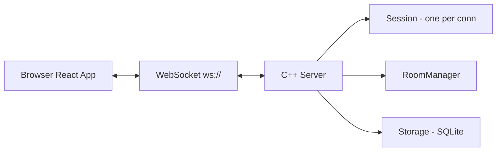

# Live Chat Server

A WebSocket-based real-time chat application with a C++ server (Boost.Beast/Asio) and a React frontend.

## Architecture



**Message flow**: Client sends JSON -> Server's `websocket_session` reads it asynchronously -> Parses type -> `room_manager` broadcasts to everyone in that room -> (Future) Storage saves it to SQLite.

## Protocol (JSON)

- **Join a room**:
  ```json
  {"type": "join", "room": "general", "user": "prashant"}
  ```
- **Send a message**:
  ```json
  {"type": "msg", "room": "general", "text": "hello", "user": "prashant"}
  ```
- **History (in progress)**:
  ```json
  {"type": "history", "room": "general", "limit": 50}
  ```
- **Presence (in progress)**:
  ```json
  {"type": "presence", "room": "general", "users": ["a", "b"]}
  ```

## DB Schema (To be implemented)

```sql
CREATE TABLE messages(
    id INTEGER PRIMARY KEY AUTOINCREMENT,
    room TEXT NOT NULL, 
    user TEXT NOT NULL,
    text TEXT NOT NULL, 
    ts INTEGER NOT NULL
);
CREATE INDEX idx_room_ts ON messages(room, ts);
```

## Progress Evaluation Checklist

| Task | Status | Notes |
|------|--------|-------|
| C++ WebSocket Server | **Done** | Accepts connections via Boost.Beast |
| Broadcasting | **Done** | Broadcasts to all connected clients |
| Basic Frontend | **Done** | React + Vite UI with connect, send, view |
| Rooms | **Done** | Isolated rooms functionality (`join`/`leave`) |
| Architecture Diagram | **Done** | See above |
| JSON Protocol Spec | **Done** | See above |
| DB Schema Design | **Done** | See above |
| SQLite History | *In Progress* | Will integrate sqlite3 C API to store messages |
| Presence tracking | *In Progress* | Map of online users in `room_manager` next |
